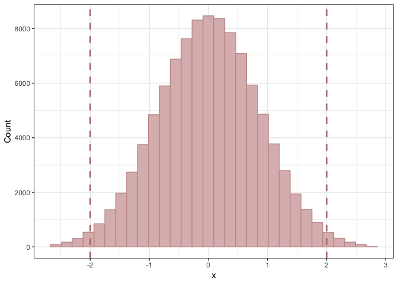

README
================
John Helveston
4/30/2019

# stanTuner

This code uses the algebra solver in [Stan](https://mc-stan.org/) to
find the parameters of a distribution that produce a desired tail
behavior. Here’s how to use it: 1. Select a distribution. 2. Define the
quantile boundaries and the amount of probability density that you wish
to have above and below those boundaries. 3. Let Stan go find the
parameters that produce the desired distribution.

Check out the `examples.R` file for a few examples.

Currently supported distributions: \* Normal \* Beta \* Inverse Gamma

# Example

Let’s say I want to find the parameters of a normal distribution such
that P\[x \< -2.0\] ~ 0.01 and P\[x \> 2.0\] ~ 0.01. That is, I want a
normal distribution where 98% of the probability density is between (-2,
2).

First, load the rstan library, tweak some settings, and source the
`utility.R`
    file:

``` r
library(rstan)
```

    ## Loading required package: ggplot2

    ## Loading required package: StanHeaders

    ## Warning: package 'StanHeaders' was built under R version 3.5.2

    ## rstan (Version 2.18.2, GitRev: 2e1f913d3ca3)

    ## For execution on a local, multicore CPU with excess RAM we recommend calling
    ## options(mc.cores = parallel::detectCores()).
    ## To avoid recompilation of unchanged Stan programs, we recommend calling
    ## rstan_options(auto_write = TRUE)

``` r
# Set auto_write to false because I want to always search from scratch
rstan_options(auto_write = FALSE)
options(mc.cores = parallel::detectCores())

util <- new.env()
source('utility.R', local=util)
```

Use the `targets` argument to set these boundaries:

Then use the `tuneParams` function to find the parameters:

    ## 
    ## SAMPLING FOR MODEL 'model' NOW (CHAIN 1).
    ## Chain 1: Iteration: 1 / 1 [100%]  (Sampling)
    ## Chain 1: 
    ## Chain 1:  Elapsed Time: 0 seconds (Warm-up)
    ## Chain 1:                2.3e-05 seconds (Sampling)
    ## Chain 1:                2.3e-05 seconds (Total)
    ## Chain 1:

View the resulting parameters and verify that the quantiles of 10,000
draws from the resulting distribution match your criteria:

``` r
result$params
```

    ## $mu
    ## [1] 0
    ## 
    ## $sigma
    ## [1] 0.85972

``` r
result$quantiles
```

    ##        1%       99% 
    ## -2.002469  1.989895

Finally, view a histogram of the resulting
    distribution:

``` r
result$histogram
```

    ## `stat_bin()` using `bins = 30`. Pick better value with `binwidth`.

<!-- -->

# Author and License

  - Author: John Paul Helveston (www.jhelvy.com)
  - Date First Written: Tuesday, April 30, 2019
  - License: GPL-3
